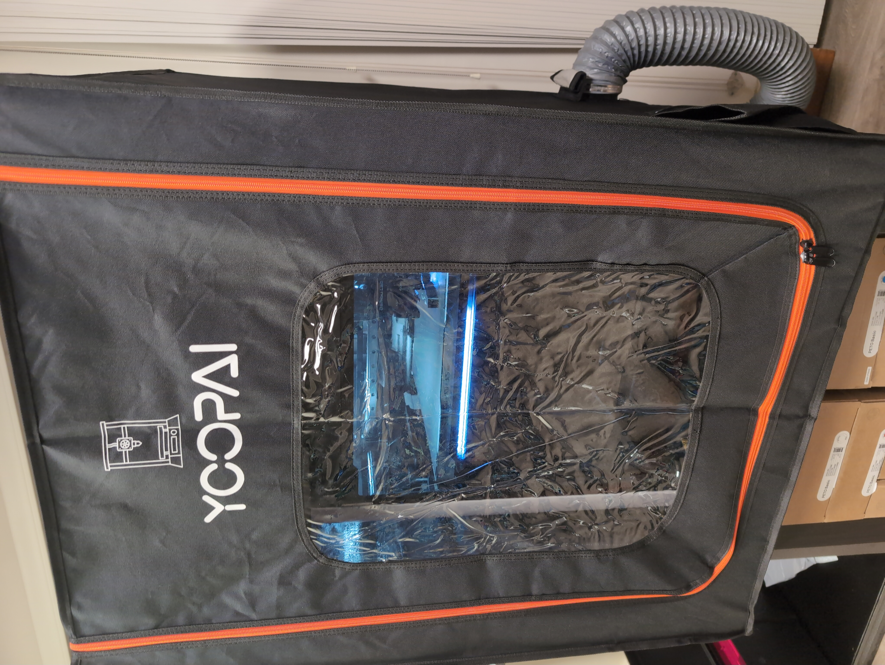
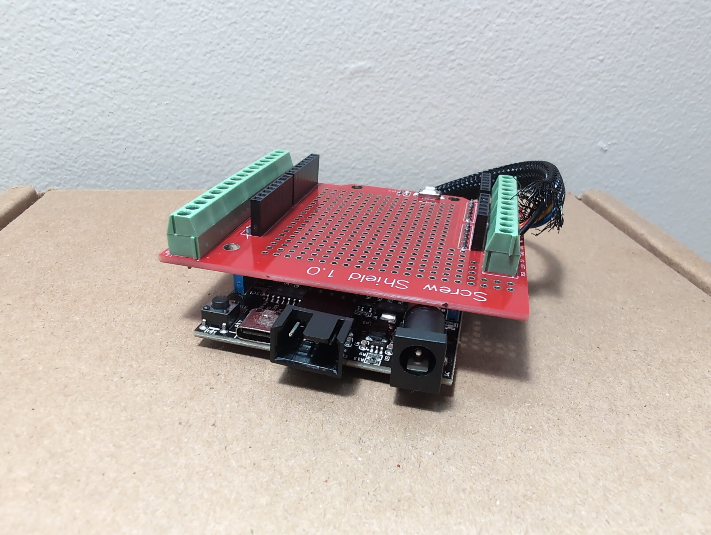

# Bambu Lab Smart Enclosure Exhaust (ESPHome)

 [](http://unlicense.org/)

This project provides a standalone, automated exhaust fan controller for Bambu Lab 3D printers running inside an enclosure. It uses an ESP32 to connect directly to the printer's local MQTT broker to monitor print status and automatically trigger a 12V PWM exhaust fan (like a Noctua) when a print starts.



**Key Features:**
* 🏠 **Fully Local & Standalone:** Connects directly to the printer's Port 8883 MQTT broker.
* 🧠 **No Home Assistant Required (but supported):** Runs its own internal logic and local web dashboard.
* 🛡️ **Safe JSON Parsing:** Uses ArduinoJson V7 directly within ESPHome to parse massive Bambu payloads without consuming excessive memory.
* 🎚️ **Auto/Manual Override:** Web UI allows you to toggle the fan manually or let the automation take over.
* 🔌 **No soldering necessary:** Eliminates the need for soldering or complicated wiring with careful hardware selection.

---

## Bill of Materials (BOM)

### Electronics
* **ESP32 Controller:** [Acebott QA007/009 ESP32 Max](https://www.amazon.com/dp/B0D5D7Q42V) (Arduino Uno form factor)
  * This board removes the need for buying multiple other components virtually eliminating the hassle of additional wiring.
* **Screw Terminal Expansion:** [Arduino Uno Compatible Screw Shield](https://www.amazon.com/dp/B0BPG2H4V2) 
* **Exhaust Fan:** [Noctua NF-A8 12V PWM](https://www.amazon.com/dp/B00NEMG62M)
  * Other 12V PWM fans should work, but may not fully stop spinning when PWM is 0%.
* **Power Supply:** 12V DC Barrel Power Supply ([Option 1](https://www.amazon.com/dp/B0BX5F3562) | [Option 2](https://www.amazon.com/dp/B086T1N5R4))

### Enclosure & Venting
* **Enclosure:** [YOOPAI 3D Printer Enclosure](https://www.amazon.com/dp/B0CF1SY5XN)
  * As far as I'm aware, all sizes use the same 70mm diameter port.
* **Window Vent:** [Dryer Vent Window Kit](https://www.amazon.com/dp/B0DQTJ292B)
  * You may of course print your own.
* **Exhaust Attachment:** [Fume Extraction for YOOPAI Enclosure](https://cults3d.com/en/3d-model/tool/fume-extraction-for-yoopiai-enclosure-large-and-rod-connector) (Requires 4x M3x60mm screws)

---

## Wiring Guide



1. Cut and strip the wires on the extra extension cable provided in the Noctua fan box.
2. Attach the Screw Shield to ESP32 board.
3. Wire the fan to the screw terminals as follows:
   * **Red Wire (12V Power):** `Vin` 
   * **Black Wire (Ground):** `GND`
   * **Blue Wire (PWM Signal):** `GPIO33`
   * **Yellow Wire (Tachometer/RPM):** `GPIO32`
```
=========================================================
                 WIRING SCHEMATIC
=========================================================

 [ 12V DC Wall Adapter ]
          |
          | (Plugs into DC Barrel Jack)
          v
+-------------------------------------------------------+
|            ACEBOTT ESP32 + SCREW SHIELD               |
|                                                       |
|    [Vin]       [GND]             [IO33]      [IO32]   |
+------|-----------|------------------|----------|------+
       |           |                  |          |
       | (Red)     | (Black)          | (Blue)   | (Yellow)
       | 12V Power | Ground           | PWM      | Tach/RPM
       |           |                  |          |
       v           v                  v          v
+-------------------------------------------------------+
|                                                       |
|               NOCTUA NF-A8 12V PWM FAN                |
|                                                       |
+-------------------------------------------------------+
```


* For reference the Acebott Documentation can be found [here](https://acebott.com/docs/qa007-qa008-qa009-esp32-max-v1-0-controller-board/).

---
## Setup

### 1. Getting Your Printer Credentials

You need three things from your printer's network settings screen (or Bambu Studio):
1. **Printer IP Address** (e.g., `192.168.1.50`)
2. **Access Code** (8-digit code acting as the password)
3. **Serial Number** (e.g., `01P00A...`)

### 2. Extracting the Bambu TLS Certificate

Bambu printers use a self-signed certificate for their MQTT broker on port 8883. You must extract this to allow the ESP32 to trust the connection. 

Run this from a Linux terminal (replace `<PRINTER_IP>`):
```bash
openssl s_client -showcerts -connect <PRINTER_IP>:8883 < /dev/null 2>/dev/null | sed -n '/-----BEGIN CERTIFICATE-----/,/-----END CERTIFICATE-----/p' > bambu_cert.pem

```

*(Optional) Test the connection from your PC:*

```bash
mosquitto_sub -h <PRINTER_IP> -p 8883 -u bblp -P <ACCESS_CODE> -t "device/<SERIAL_NUMBER>/report" --insecure --cafile bambu_cert.pem --ciphers "DEFAULT:@SECLEVEL=0" -d

```

### 3. ESPHome Configuration

Create a new device in ESPHome and paste the following configuration.
**Make sure to update the IP, Access Code, Serial Number, and Certificate.**

```yaml
esphome:
  name: bambu-exhaust-fan-esphome
  friendly_name: bambu_exhaust_fan

esp32:
  board: esp32dev
  variant: ESP32

# Enable Web UI
web_server:
  port: 80

# Enable built-in ArduinoJson library
json:

globals:
  - id: printer_is_running
    type: bool
    initial_value: 'false'

# Virtual switch to toggle between Auto (MQTT) and Manual control
switch:
  - platform: template
    name: "Automated MQTT Control"
    id: auto_mode
    optimistic: true
    restore_mode: RESTORE_DEFAULT_ON

# Fan PWM Output
output:
  - platform: ledc
    pin: GPIO33
    id: fan_pwm
    frequency: 25000 Hz # Standard for PC Fans

fan:
  - platform: speed
    output: fan_pwm
    name: "Enclosure Exhaust Fan"
    id: bambu_fan

# Fan RPM Tachometer
sensor:
  - platform: pulse_counter
    pin:
      number: GPIO32
      mode: INPUT_PULLUP # Required for open-collector tachometers
    name: "Exhaust Fan Speed"
    id: fan_rpm
    unit_of_measurement: "RPM"
    update_interval: 2s
    filters:
      - multiply: 0.5 # 2 pulses per revolution

# Printer Status
text_sensor:
  - platform: template
    name: "Printer State"
    id: printer_state_sensor
    icon: "mdi:printer-3d"

# Local Bambu MQTT Connection
mqtt:
  broker: "192.168.1.50"       # REPLACE with Printer IP
  port: 8883
  username: "bblp"
  password: "YOUR_ACCESS_CODE" # REPLACE with Access Code
  client_id: "esphome_exhaust_controller"
  skip_cert_cn_check: true        # Required to bypass Bambu's self-signed TLS cert
  discovery: false                # Prevents ESPHome from spamming the printer's broker
  
  # REPLACE with the contents of your bambu_cert.pem
  certificate_authority: |
    -----BEGIN CERTIFICATE-----
    MIIDXTCCAkWgAwIBAgIEX... 
    ...
    ...
    -----END CERTIFICATE-----

  on_message:
    - topic: "device/YOUR_SERIAL_NUMBER/report" # REPLACE with your Serial Number
      then:
        - lambda: |-
            // The 'x' variable holds the raw MQTT payload string
            std::string payload = x;

            // Fast-fail: Only parse if "gcode_state" is actually in this payload
            // This saves the ESP32 from parsing useless delta updates
            if (payload.find("\"gcode_state\":") != std::string::npos) {

              // Use ESPHome's built-in ArduinoJson wrapper
              auto doc = json::parse_json(payload);
              auto root = doc.as<JsonObject>();
                                 
              // 1. Check if the "print" object exists
              if (root["print"]) {
                JsonObject print_data = root["print"];
                              
                // 2. Check if the "gcode_state" key exists inside "print"
                if (print_data["gcode_state"]) {
                                
                  // 3. Extract it as a string
                  auto state = print_data["gcode_state"].as<std::string>();
                                
                  // 4. Evaluate it
                  if (state == "RUNNING" || state == "PREPARE" || state == "PAUSE") {
                    id(printer_state_sensor)->publish_state("RUNNING");
                    id(printer_is_running) = true;
                  } else if (state == "IDLE" || state == "FINISH" || state == "FAILED") {
                    id(printer_state_sensor)->publish_state("STOPPED");
                    id(printer_is_running) = false;
                  }
                }
              }
            }
            
        # 4. Trigger Fan logic based on state, obeying the Auto/Manual switch
        - if:
            condition:
              switch.is_on: auto_mode
            then:
              - if:
                  condition:
                    lambda: 'return id(printer_is_running);'
                  then:
                    - fan.turn_on:
                        id: bambu_fan
                        speed: 100
                  else:
                    - fan.turn_off:
                        id: bambu_fan

```